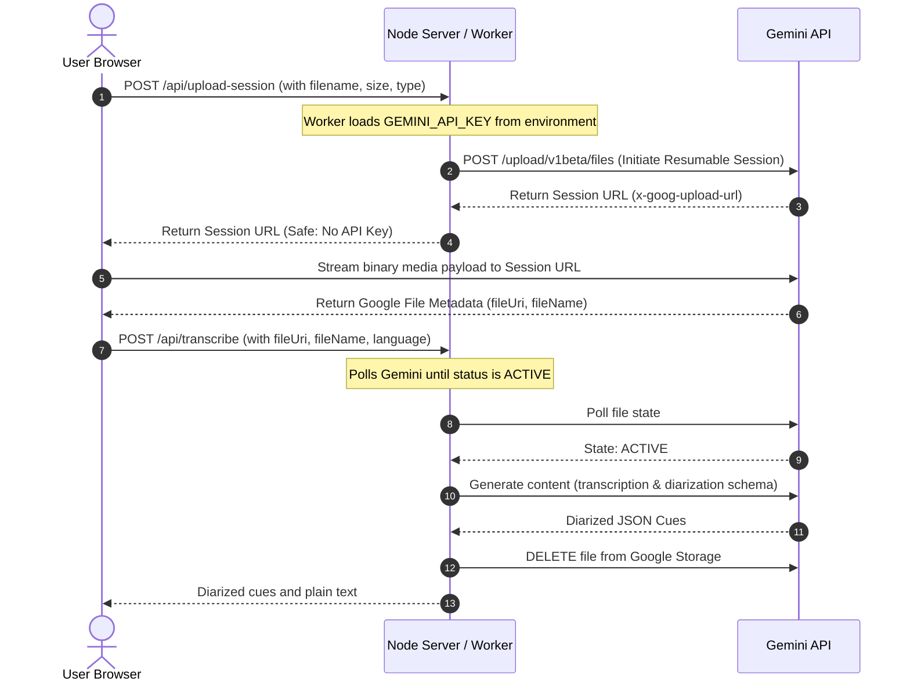

# 🎥 Transcript Studio

An elegant, high-performance, and secure video review workspace powered by Google Gemini AI. 

Transcript Studio allows content creators, editors, and reviewers to upload media files, auto-transcribe them with diarization (speaker detection), perform interactive review synchronized with playback, search cues, and collaborate with an **AI Brain** to instantly extract chapters, pull quotes, summaries, and social media drafts.

---

## ✨ Key Features

- **🔒 100% Secure Architecture:** The `GEMINI_API_KEY` is fully hidden on the server/worker side. It never leaks to the client or source code.
- **🚀 High-Performance Resumable Uploads:** Utilizes Google's Resumable Upload protocol to stream large video/audio files directly to the Google Files API. This prevents memory limits or timeout errors on intermediate proxies (like Cloudflare or local Node limits).
- **🗣️ Advanced Diarization:** Auto-detects different speakers and labels them systematically.
- **⏱️ Synchronized Media Player:** Click on any transcript cue to jump the player directly to that timestamp. The transcript automatically scrolls and highlights the active cue during playback.
- **🧠 Interactive AI Brain:** 
  - **Quick Actions:** Instant one-click summaries, chapter outlines, pull quotes, and social media draft generation.
  - **Contextual Chat:** Chat with the AI about any specific content in your transcript.
  - **Notes Integration:** Review insights and click "Apply to Notes" to save them directly to your project workspace.
- **📁 Multi-Project Local History:** Automatically saves up to 40 historical projects in the browser's `localStorage` with offline support and soft limits.
- **🌓 Sleek Modern Design:** Curated light/dark aesthetics featuring premium glassmorphism, responsive split-pane layout, subtle micro-animations, and full mobile optimization.

---

## 🛠️ Architecture Overview



---

## 🚀 Getting Started

### Prerequisites
- Node.js (version 18 or higher)
- A Google AI Studio API key (obtain one from [Google AI Studio](https://aistudio.google.com/))

### 1. Local Development Setup
1. Clone the repository to your local system.
2. In the root directory, create a `.env.local` file:
   ```bash
   GEMINI_API_KEY=your_actual_gemini_api_key_here
   GEMINI_MODEL=gemini-2.5-flash
   PORT=4173
   ```
3. Start the local server:
   ```bash
   npm start
   ```
4. Open [http://127.0.0.1:4173/](http://127.0.0.1:4173/) in your web browser.

---

## 🌐 Production Deployment

To host your static page on GitHub Pages, Vercel, or Netlify while keeping your Gemini API key 100% secure, you can deploy the included **Cloudflare Worker** as your proxy.

### 1. Deploy the Cloudflare Worker
1. Install the Wrangler CLI globally:
   ```bash
   npm install -g wrangler
   ```
2. Log into your Cloudflare account:
   ```bash
   wrangler login
   ```
3. Set your secure `GEMINI_API_KEY` secret inside Cloudflare:
   ```bash
   wrangler secret put GEMINI_API_KEY
   ```
   *Paste your API key when prompted.*
4. Deploy the worker:
   ```bash
   wrangler deploy
   ```
5. You will get a deployment URL like:
   `https://transcript-studio.YOUR-SUBDOMAIN.workers.dev`

### 2. Configure the Frontend
1. Open [script.js](file:///Users/Richard/Documents/Transcript%20Video%20website/script.js) and find the `API_BASE` constant at the top of the file:
   ```javascript
   const API_BASE =
     window.location.hostname === "localhost" ||
     window.location.hostname === "127.0.0.1"
       ? "" // local Node.js server handles /api/* (relative URL)
       : "https://transcript-studio.REPLACE_WITH_YOUR_WORKERS_DEV_URL";
   ```
2. Replace `https://transcript-studio.REPLACE_WITH_YOUR_WORKERS_DEV_URL` with your deployed Cloudflare Worker URL.
3. Push your repository to **GitHub** and configure **GitHub Pages** to serve from the root directory or `main` branch.

---

## 💡 Performance & Usage Tips

- **🎵 Audio Uploads:** Instead of uploading a heavy 2GB `.mp4` video, you can upload `.mp3`, `.wav`, or `.m4a` audio files. The transcription runs near-instantly since the upload time is minimized!
- **Speaker Naming:** Set the default speaker's name in the metadata fields before starting transcription, or edit speaker tags manually in the **Edit** tab.
- **AI Formatting:** If pasting a raw timestamped text, use the **Format timestamps** button in the Edit tab to automatically parse it into interactive cues.

---

## 📄 License
This project is open-source and available under the MIT License.
